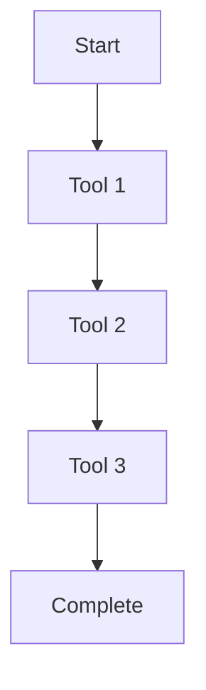
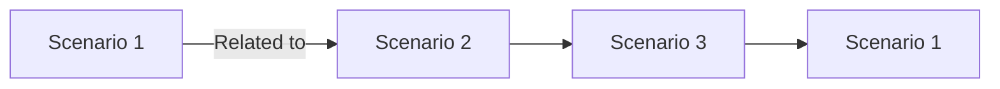

# Agent Testing Suite

**World-class testing framework for evaluating AI agent performance with A/B testing, metrics tracking, and rich visualization.**

---

## Overview

The Agent Testing Suite provides comprehensive evaluation capabilities for AI agents, supporting long-horizon tasks, A/B testing between models/prompts/configurations, and detailed metrics analysis with a React web UI.

### Key Features

| Feature | Description |
|---------|-------------|
| **Long-Horizon Tasks** | Multi-step workflow evaluation |
| **A/B Testing** | Compare models, prompts, configurations |
| **Comprehensive Metrics** | Success rates, tool usage, tokens, duration |
| **React Web UI** | Test management and visualization |
| **Rich HTML Reports** | Mermaid diagrams, knowledge graphs |
| **Scalable** | Run multiple scenarios in parallel |

---

## Installation

### Quick Start

```bash
# Navigate to agent testing suite
cd agent-testing-suite

# Install dependencies
npm install

# Build the project
npm run build

# Initialize test workspace
ff-test init
```

### Verify Installation

```bash
# Check CLI is available
ff-test --help

# Should show:
# Usage: ff-test <command> [options]
#
# Commands:
#   init         Initialize test workspace
#   run          Run test suite
#   report       Generate report for test run
#   compare      Compare two test runs
#   serve        Start web UI
```

---

## Test Suite Structure

### Directory Layout

```
agent-testing-suite/
├── src/
│   ├── cli/              # CLI implementation
│   ├── core/             # Core testing logic
│   ├── metrics/          # Metrics calculation
│   ├── reports/          # Report generation
│   └── web/              # React web UI
├── suites/               # Test suites
│   └── custom/           # Custom test suites
├── runs/                 # Test run outputs
├── reports/              # Generated reports
├── package.json
└── tsconfig.json
```

---

## Creating Test Suites

### Test Suite YAML Format

**Location**: `suites/custom/my-tests.yaml`

```yaml
name: Code Generation Tests
description: Evaluate code generation capabilities

scenarios:
  - name: Generate React component
    prompt: Create a responsive card component with props for title, description, and an image URL
    rubrics:
      - name: code-quality
        weight: 1.0
        criteria: Component compiles without TypeScript errors
        evaluator: script
        script: |
          #!/bin/bash
          npx tsc --noEmit generated-component.tsx
          echo $?

      - name: responsiveness
        weight: 0.8
        criteria: Component uses responsive design patterns
        evaluator: llm
        model: gpt-4

      - name: best-practices
        weight: 0.6
        criteria: Follows React best practices
        evaluator: llm
        model: claude-3-5-sonnet

  - name: Fix bug in function
    prompt: Fix the bug in this function: const double = (x) => x * 2;
    context: |
      The function should return the input multiplied by 2, but it's returning undefined.
    expected-output: Function returns correct value for various inputs
    rubrics:
      - name: correctness
        weight: 1.0
        criteria: Function returns correct result for all test cases
        evaluator: automated
        test-cases:
          - input: 2
            expected: 4
          - input: 5
            expected: 10
          - input: -3
            expected: -6
```

### Scenario Types

#### 1. Code Generation

```yaml
scenarios:
  - name: Create TypeScript function
    prompt: Create a function that validates email addresses
    output-expected:
      - TypeScript function with proper types
      - Regex pattern for email validation
      - Unit tests included
    rubrics:
      - name: type-safety
        weight: 1.0
        criteria: All parameters and return values typed
```

#### 2. Tool Usage

```yaml
scenarios:
  - name: Use readFile tool
    prompt: Read the file config.json and extract the API key
    tools-expected:
      - readFile
    rubrics:
      - name: tool-correctness
        weight: 1.0
        criteria: Correctly uses readFile tool
```

#### 3. Multi-Step Planning

```yaml
scenarios:
  - name: Refactor codebase
    prompt: Refactor the utils.ts file to use TypeScript best practices
    steps-expected: 3
    rubrics:
      - name: planning
        weight: 0.8
        criteria: Creates clear execution plan

      - name: execution
        weight: 1.0
        criteria: Follows plan correctly
```

---

## Rubric Evaluation

### Evaluator Types

#### 1. Script Evaluator

```yaml
rubrics:
  - name: compilation
    weight: 1.0
    criteria: Code compiles without errors
    evaluator: script
    script: |
      #!/bin/bash
      npx tsc --noEmit output.ts
      exit $?
```

#### 2. LLM Evaluator

```yaml
rubrics:
  - name: code-quality
    weight: 0.8
    criteria: Follows best practices and patterns
    evaluator: llm
    model: gpt-4
    prompt: |
      Rate the code quality of the following output from 0-10:
      {output}

      Consider:
      - Readability
      - Maintainability
      - Performance
      - Security
```

#### 3. Automated Evaluator

```yaml
rubrics:
  - name: correctness
    weight: 1.0
    criteria: Produces correct output
    evaluator: automated
    test-cases:
      - input: "hello world"
        expected: "HELLO WORLD"
      - input: "test"
        expected: "TEST"
```

#### 4. Human Evaluator

```yaml
rubrics:
  - name: creativity
    weight: 0.5
    criteria: Creative and innovative solution
    evaluator: human
    instructions: |
      Rate creativity on scale 1-5:
      1 - Not creative
      3 - Somewhat creative
      5 - Very creative
```

---

## Running Tests

### Basic Test Execution

```bash
# Run entire test suite
ff-test run example-coding-tasks

# Run specific scenario
ff-test run example-coding-tasks --scenario "Generate React component"

# Run with specific model
ff-test run example-coding-tasks --model claude-3-5-sonnet

# Run with specific profile
ff-test run example-coding-tasks --profile development

# Run with parallel execution
ff-test run example-coding-tasks --parallel 4
```

### A/B Testing

```bash
# Compare two models
ff-test run example-coding-tasks \
  --model-a claude-3-5-sonnet \
  --model-b gpt-4 \
  --label-a "Claude" \
  --label-b "GPT-4"

# Compare prompts
ff-test run example-coding-tasks \
  --prompt-a prompts/v1.txt \
  --prompt-b prompts/v2.txt

# Compare configurations
ff-test run example-coding-tasks \
  --config-a config/dev.yaml \
  --config-b config/prod.yaml
```

### Advanced Options

```bash
# Custom timeout (seconds)
ff-test run example-coding-tasks --timeout 300

# Save intermediate results
ff-test run example-coding-tasks --save-intermediate

# Resume from checkpoint
ff-test run example-coding-tasks --resume checkpoint-123

# Dry run (no execution)
ff-test run example-coding-tasks --dry-run

# Verbose output
ff-test run example-coding-tasks --verbose
```

---

## Metrics & Analysis

### Collected Metrics

| Metric | Description | Unit |
|--------|-------------|------|
| Success Rate | Percentage of scenarios passed | % |
| Tool Usage | Number and type of tools used | count |
| Token Count | Input and output tokens | tokens |
| Duration | Execution time per scenario | seconds |
| Rubric Scores | Weighted average of rubric scores | 0-1 |
| Plan Accuracy | Plan correctness for planning tasks | % |
| Turn Count | Number of agent turns | count |

### Viewing Metrics

```bash
# Generate report
ff-test report run-12345

# View metrics in terminal
ff-test report run-12345 --format table

# Export to JSON
ff-test report run-12345 --format json > metrics.json

# Export to CSV
ff-test report run-12345 --format csv > metrics.csv
```

### Comparing Runs

```bash
# Compare two runs
ff-test compare run-12345 run-67890

# Compare specific metric
ff-test compare run-12345 run-67890 --metric success-rate

# Generate comparison report
ff-test compare run-12345 run-67890 --output comparison-report.html
```

---

## Web UI

### Starting the Web UI

```bash
# Development mode
cd agent-testing-suite
npm run dev

# Serve reports
npm run dev serve

# Custom port
PORT=3001 npm run dev serve
```

### Web UI Features

- **Dashboard**: Overview of test runs and metrics
- **Run Details**: Detailed results for each scenario
- **Comparison View**: Side-by-side comparison of A/B tests
- **Rubric Breakdown**: Detailed rubric scores and comments
- **Timeline Visualization**: Execution timeline with tool calls
- **Knowledge Graph**: Relationships between scenarios and outcomes

### API Endpoints

```bash
# List all runs
GET /api/runs

# Get run details
GET /api/runs/:runId

# Get scenario results
GET /api/runs/:runId/scenarios/:scenarioId

# Compare runs
GET /api/compare/:runIdA/:runIdB

# Generate report
GET /api/runs/:runId/report
```

---

## Report Generation

### HTML Report

```bash
# Generate HTML report
ff-test report run-12345 --format html

# Custom template
ff-test report run-12345 --format html --template custom-report.hbs

# Include charts
ff-test report run-12345 --format html --charts
```

### Report Features

**Timeline Diagram** (Mermaid):


**Knowledge Graph** (Mermaid):


**Metrics Charts**:
- Success rate over time
- Token usage distribution
- Tool usage breakdown
- Duration histogram

---

## Custom Evaluators

### Creating Custom Evaluators

**Location**: `agent-testing-suite/src/evaluators/custom.ts`

```typescript
import { Evaluator, EvaluatorResult } from '../types/evaluator.js';

export const customEvaluator: Evaluator = {
  name: 'custom',
  evaluate: async (scenario, output) => {
    // Custom evaluation logic
    const score = calculateCustomScore(output);

    return {
      success: score > 0.5,
      score,
      feedback: generateFeedback(output),
    };
  },
};
```

### Registering Custom Evaluator

```typescript
// src/evaluators/index.ts
import { customEvaluator } from './custom.js';

export const EVALUATORS = {
  script: scriptEvaluator,
  llm: llmEvaluator,
  automated: automatedEvaluator,
  human: humanEvaluator,
  custom: customEvaluator,  // Add custom evaluator
};
```

### Using Custom Evaluator in Test Suite

```yaml
rubrics:
  - name: custom-metric
    weight: 1.0
    criteria: Evaluated by custom logic
    evaluator: custom
```

---

## Integration with FF Terminal

### Testing FF Terminal Agents

```yaml
scenarios:
  - name: Multi-step code generation
    agent: ff-terminal
    profile: development
    prompt: Create a TypeScript project structure with:
      1. Source files in src/
      2. Tests in tests/
      3. Configuration files

    rubrics:
      - name: structure-correctness
        weight: 1.0
        evaluator: automated
        script: |
          #!/bin/bash
          [[ -d src ]] && [[ -d tests ]] && echo 1 || echo 0
```

### Using FF Terminal Tools

```yaml
scenarios:
  - name: Use file operations
    agent: ff-terminal
    tools-allowed:
      - readFile
      - writeFile
      - runCommand

    prompt: Create a new project with package.json and tsconfig.json

    rubrics:
      - name: file-creation
        weight: 1.0
        evaluator: automated
        script: |
          [[ -f package.json ]] && [[ -f tsconfig.json ]] && echo 1 || echo 0
```

---

## Best Practices

### 1. Scenario Design

- **Clear prompts**: Be specific about requirements
- **Realistic tasks**: Test actual use cases
- **Appropriate complexity**: Not too simple, not too complex
- **Independent scenarios**: No dependencies between scenarios

### 2. Rubric Definition

- **Measurable criteria**: Quantifiable metrics
- **Appropriate weights**: Reflect importance
- **Multiple dimensions**: Test different aspects
- **Consistent evaluation**: Use automated evaluators when possible

### 3. Test Data

- **Clean data**: Well-structured and formatted
- **Representative**: Realistic test cases
- **Edge cases**: Include boundary conditions
- **Privacy**: No sensitive information

### 4. Result Analysis

- **Compare with baseline**: Track performance over time
- **Look for patterns**: Identify common failure modes
- **Investigate outliers**: Understand extreme results
- **Iterate**: Improve scenarios based on results

---

## Troubleshooting

### Test Runs Fail

**Check**:
```bash
# Verify test suite syntax
ff-test validate my-tests.yaml

# Check tool availability
ff-test run my-tests --dry-run

# Enable verbose logging
ff-test run my-tests --verbose
```

### Evaluators Fail

**Solutions**:
- Check evaluator script permissions
- Verify LLM API credentials
- Validate test case expectations
- Check evaluator output format

### Web UI Issues

**Solutions**:
```bash
# Clear cache
rm -rf node_modules/.cache

# Rebuild
npm run build

# Check port availability
lsof -ti:3000 | xargs kill
```

---

## Example Test Suite

### Complete Example

```yaml
name: FF Terminal Agent Evaluation
description: Comprehensive evaluation of FF Terminal agent capabilities

scenarios:
  - name: Create React component
    prompt: Create a responsive card component for displaying products with title, price, and image
    rubrics:
      - name: typescript
        weight: 1.0
        criteria: Proper TypeScript types defined
        evaluator: script
        script: npx tsc --noEmit generated.tsx

      - name: responsiveness
        weight: 0.8
        criteria: Responsive CSS patterns used
        evaluator: llm
        model: gpt-4

  - name: Debug failing code
    prompt: Debug this code and fix the issue: const sum = (a, b) => a + b;
    context: The function returns "1" + 2 = "12" instead of 3
    rubrics:
      - name: fix-correctness
        weight: 1.0
        criteria: Function correctly adds numbers
        evaluator: automated
        test-cases:
          - input: [1, 2]
            expected: 3
          - input: [10, 20]
            expected: 30

  - name: Plan and execute
    prompt: Create a simple REST API with Express.js that has /users endpoint
    steps-expected: 5
    rubrics:
      - name: planning
        weight: 0.8
        criteria: Clear execution plan created
        evaluator: llm

      - name: execution
        weight: 1.0
        criteria: All steps completed correctly
        evaluator: automated
        script: |
          [[ -f server.js ]] && grep -q "express" server.js && echo 1 || echo 0
```

---

## Resources

- [Vitest Documentation](https://vitest.dev/)
- [Mermaid Documentation](https://mermaid.js.org/)
- [React Documentation](https://react.dev/)
- [FF Terminal Main README](../../README.md)

---

**Last Updated**: 2026-02-02
